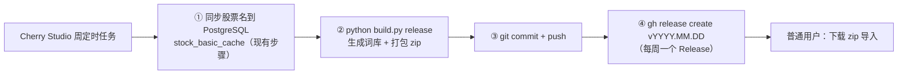

# astock-ime

A 股股票名的**输入法自定义短语词库**：敲 `payh` 出「平安银行」，敲 `ndsd` 出「宁德时代」，敲 `byd` 出「比亚迪」。

覆盖 Win10/11 自带**微软拼音**、**微信输入法**、**搜狗输入法**（附赠 Rime / 通用自定义短语格式）。
**每周一个 Release**，下 zip 解压导入就行——不用装 Python，也不用连数据库。


---

## 1. 拿来就用（推荐路径）

👉 **[Releases](https://github.com/jcone211/astock-ime/releases/latest)** 下载最新的 `astock-ime-vYYYY.MM.DD.zip`，解压后按你用的输入法导入**一个文件**：

| 输入法 | 导入这个文件 | 在哪导入 |
|---|---|---|
| **微软拼音**（Win10/11 自带） | `ms_pinyin_astock.dat` | 右下角微软输入法右键点击 → 词库和自学习 → 用户自定义短语 → 导入 |
| **微信输入法** | `wechat_astock_words.txt` | 输入法设置 → 词库 → 导入本地词库（手机端同） |
| **搜狗输入法** | `sogou_astock.txt`（GBK，别另存为 UTF-8） | 属性设置 → 词库 → 导入词库；没有该入口就用 `custom_phrase_astock.txt` |

zip 里的 `README-导入说明.txt` 是同一份说明的纯文本版；细节（回滚、手机端、常见问题）见
[docs/import-guide.md](docs/import-guide.md)。

导入后随便找个输入框试：`payh` `wka`（万科A）`tclkj`（TCL科技）`stml`（ST美丽）。
当前规模：**5647 条词条 / 4392 个编码 / 覆盖 5552 只在市 A 股**，平均一个编码只有 1.29 个候选。

> 之前自己导过一版？**先删掉旧的再导新的**，否则候选里会出现两份同名条目。

---

## 2. 词库怎么更新



版本号规则 `vYYYY.MM.DD`；同一周多次重跑只覆盖该 release 的附件，不会刷屏。
第 ② 步由本仓库一条命令完成，接线方法与排错见 **[docs/automation.md](docs/automation.md)**。

---

## 3. 自己生成一份（进阶 · 通用适配）

只有当你**不想用我发布的词库**（换数据源、换库、改表名/字段名、只想导部分股票）时才需要这节。

### 3.1 装环境

```bash
git clone https://github.com/jcone211/astock-ime.git astock-ime && cd astock-ime
pip install -r requirements.txt          # pypinyin + psycopg2-binary
cp config.example.json config.json       # config.json 已被 gitignore，密码不进仓库
```

### 3.2 配你的数据库（三处必改）

```jsonc
{
  "database": {
    "access": "auto",                  // direct=psycopg2 直连；docker=docker exec psql；auto=先直连再降级
    "host": "127.0.0.1", "port": 5432,
    "dbname": "stock", "user": "postgres",
    "docker_container": "my-postgres", // access 走 docker 时用
    "table": "stock_basic_cache",      // ① 股票名所在的表
    "name_column": "name",             // ② 股票名称字段
    "code_column": "ts_code",          //   代码字段（--code-alias / 热度加权要用）
    "delisted_column": "dead_tag",     //   退市标记列；没有就把 exclude_delisted 设 false
    "exclude_delisted": true,
    "where": "",                       // 额外过滤条件，如 "industry <> '银行'"
    "order_by": "ts_code",
    "hot": { "table": "a_share_daily", "code_column": "code",
             "amount_column": "amount", "date_column": "date" }   // --freq hot 用
  },
  "tools": { "imewl_converter": "D:/tools/imewlconverter_win-x64/cli/ImeWlConverterCmd.exe" }
}
```

```bash
export PGPASSWORD='库密码'      # 密码只从环境变量读；不设则自动走 docker exec
```

### 3.3 生成

```bash
python build.py all                                   # 全量，产物在 dist/
python build.py all --freq hot --limit 800            # 只要最活跃的 800 只，热门靠前
python build.py all --exclude-st                      # 不要风险警示股
python build.py all --code-alias                      # 追加 000001 → 平安银行
python build.py all --source csv --csv examples/stock_names.sample.csv   # 不连库，离线试跑
python build.py all --no-imewl                        # 不装深蓝也能出文本词库（.dat 除外）
python build.py release --create-repo                 # 顺手建仓 + 发第一个 Release
python build.py release --dry-run                     # 只看将执行哪些 git/gh 命令
```

深蓝词库转换只负责微软拼音那个二进制 `.dat`；找不到它会跳过并提示下载地址，其余格式本仓库自己产出。
词库文件与编码规则细节见 [docs/formats.md](docs/formats.md)。

---

## 4. 编码规则

```text
剔除星号 * → 只留汉字/字母/数字 → pypinyin 整词取拼音首字母 → 统一小写 → 校验 ^[a-z0-9]{2,16}$
```

所以 `万科A` → `wka`（不是 `wkA`）、`*ST美丽` → `stml`（不是 `*STml`）、`重庆钢铁` → `cqgt`（重=chong）。
旧产物的实测代价：旧 `.dat` 只有 5444 条、**0 条带 `*`**（95 只风险警示股被词库转换静默过滤）、
146 个编码带大写；新 `.dat` 是 5552 条、全小写，而且每次转换都会把产物**回读校验**
（`[verify] 回读 5552/5552`）。完整对照表与复现过程见 [docs/formats.md](docs/formats.md)。

---

代码 MIT（[LICENSE](LICENSE)）· 全程只 `SELECT` 读本地库，**不调用 Tushare 接口** ·
词库由周定时任务自动生成，导入指南见 [docs/import-guide.md](docs/import-guide.md)。
