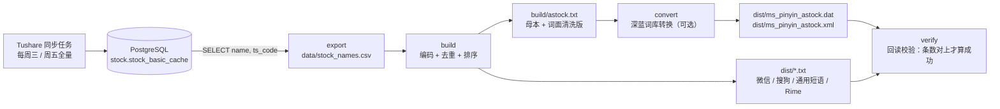

# astock-ime

> 把 A 股全部股票名灌进输入法的「用户自定义短语 / 词库」，
> 之后打 `payh` 出「平安银行」，打 `ndsd` 出「宁德时代」，打 `byd` 出「比亚迪」。

**Win10/11 自带微软拼音、微信输入法、搜狗输入法** 三家的词库一次性生成好，导入即用。
数据从**本地 PostgreSQL** 读，不再直接调 Tushare（接口限额极紧，一天可能就 1 次机会）。


<!-- CI 徽章换成你自己的用户名：
 -->

---

## 为什么这么干

盯盘、写复盘、群里聊票的时候，最烦的两件事：

1. 「平安银行」要打 4 个全拼，或者打首字母后在一堆「平安XX/盘后XX」里翻那只票；
2. 股票简称天天变，手写词库跟不上。

本项目把整份 A 股名册（5552 只在市股票）编成**首字母 → 股票名**的短语表，
一次导入，之后 4 个字母直接上屏；名册随数据库更新，重跑一条命令即可。

效果（`build/astock.txt` 里的真实条目）：

| 你敲 | 候选 |
|---|---|
| `payh` | 平安银行 |
| `ndsd` | 宁德时代 |
| `gzmt` | 贵州茅台 |
| `hwj` | 寒武纪 |
| `tclkj` | TCL科技 |
| `wka` | 万科A |
| `stml` | *ST美丽 / ST美丽 |

5647 条词条 / 4392 个唯一编码，**平均每个编码只有 1.29 个候选，96.9% 的编码 ≤3 个候选**——
绝大多数股票是「四字母直达」。

---

## 30 秒上手

```bash
git clone <你的仓库地址> astock-ime && cd astock-ime

pip install -r requirements.txt        # 只要 pypinyin（读库再装 psycopg2-binary）
cp config.example.json config.json     # 填数据库连接
export PGPASSWORD='你的库密码'          # 密码只走环境变量，不进仓库

python build.py all                    # Windows 也可以用 .\run.ps1 / ./run.sh
```

产物全在 `dist/`，按输入法挑一个导入（步骤见 [docs/import-guide.md](docs/import-guide.md)）：

| 你的输入法 | 导入这个文件 |
|---|---|
| **微软拼音**（Win10/11 自带） | `dist/ms_pinyin_astock.dat` |
| **微信输入法**（PC / 手机） | `dist/wechat_astock_words.txt`（备选 `wechat_astock_code.txt`） |
| **搜狗输入法** | `dist/sogou_astock.txt`（或 `custom_phrase_astock.txt`） |
| Rime 中州韵（附赠） | `dist/astock_rime.yaml` |

没装「深蓝词库转换」也能跑：文本格式全部由本仓库自己产出，
深蓝只负责微软拼音那个 `.dat`（找不到工具时会自动跳过并提示下载地址）。

---

## 数据来源：读库，不碰 Tushare



* 默认取数 SQL：`sql/names.sql`（只 SELECT；库连接、表名、列名全在 `config.json` 里）；
* 连接方式 `access` 支持 `direct`（psycopg2 直连）、`docker`（`docker exec` 进容器跑 `psql`，宿主机没映射端口时用）和 `auto`（先直连，失败自动降级 docker）；
* **本项目从不调用 Tushare 接口**，行情/名册的更新由你已有的同步任务负责；
* 没有数据库也能玩：`python build.py all --source csv --csv examples/stock_names.sample.csv`（离线样例，CI 就是这么跑的）。

---

## 相对旧流程的改进

旧流程：`tushare 拉全市场日线 CSV` → `csv_to_astock.py` → `astock.txt` → `深蓝 CLI` → `.dat`。

| # | 问题 | 现在 |
|---|---|---|
| 1 | 直接打 Tushare 接口，限额一收紧就整条链路失败 | 改成 `SELECT name FROM stock_basic_cache`，随便重跑，零接口消耗 |
| 2 | `*ST美丽` → 编码 `*STml`，深蓝把这类条目**静默过滤**，5552 只里 95 只风险警示股全部丢失 | 编码去掉 `*` → `stml`；另外给深蓝一份「词面也去掉前导符号」的清洗副本，95 只全保住 |
| 3 | `万科A` → `wkA`（大小写混在编码里，输入习惯不一致，还容易和 `wka` 撞出两套码） | 编码统一小写：`wka` / `szya` / `tclkj` |
| 4 | 只有一个 Windows 微软拼音产物，换输入法要手工再转 | 一次生成微软拼音 / 微信 / 搜狗（+ Rime、通用自定义短语）全套文本与二进制 |
| 5 | 转换「成功」与否只看命令行有没有报错，丢词条看不见 | 新增 **`verify` 回读校验**：把产物再读一遍数条数；也正是它暴露了深蓝 3.4 的 `.scel` 导出只写表头（5552 → 2）这个坑，所以 scel 默认不导 |
| 6 | 词库顺序 = CSV 顺序，冷门票挤在热门票前面 | `--freq hot` 用近 N 日成交额给词频；`--limit`、`--exclude-st`、`--code-alias` 控制词库形状 |

---

## 编码规则（一句话版）

```text
星号 * 剔除 → 只留汉字/字母/数字 → pypinyin 整词取首字母 → 全部小写 → 校验 ^[a-z0-9]{2,16}$
```

细节、反例、多音字取舍，以及「为什么 ST 股票要放两条」，见 [docs/formats.md](docs/formats.md)。
规则全部有单测：

```bash
python -m unittest discover -s tests -v
```

---

## 命令行

```text
python build.py [export|build|convert|all] [选项]

  --source {db,csv}       名称来源，默认 db；csv 模式离线可跑
  --csv PATH              --source csv 时读的文件（默认 data/stock_names.csv）
  --config PATH           配置文件（默认 ./config.json）

词条规则
  --freq {flat,hot}       hot = 按近 N 个交易日成交额加权，热门票候选靠前
  --hot-days N            成交额统计窗口，默认 20
  --limit N               只保留前 N 条（输入法条目上限吃紧 / 只想导常用票时）
  --exclude-st            整条剔除 *ST / ST 风险警示股
  --strip-star-word       上屏词面也去掉 *（词面变 ST美丽，官方名称就不保留了）
  --no-star-variants      不额外生成「去星号」那条备用词条
  --code-alias            追加「000001 → 平安银行」这类代码短语
  --rank N                所有词条的统一词频（默认 1）

深蓝词库转换
  --no-imewl              只出文本词库，不调外部工具
  --imewl PATH            ImeWlConverterCmd 路径（也可写在 config.json）
  --targets a,b           要导出的原生格式（默认 win10mspy,mspy；scel 已知有损，默认不导）
```

常用组合：

```bash
python build.py all                                  # 全量，5552 只在市股票
python build.py all --freq hot --limit 800           # 只要最活跃的 800 只，热门靠前
python build.py build --source csv --csv examples/stock_names.sample.csv   # 离线试跑
python build.py convert --targets win10mspy,mspy     # 只重跑原生格式
```

---

## 目录结构

```text
astock-ime/
├── build.py                    # 顶层入口（自动把 src/ 加进 sys.path）
├── config.example.json         # 数据库 / 构建 / 工具路径配置模板
├── requirements.txt            # pypinyin + psycopg2-binary
├── run.ps1 / run.sh            # 一键脚本
├── CHANGELOG.md                # 相对旧流程的改动清单
├── sql/names.sql               # 取数 SQL 模板（默认由代码按配置拼装）
├── src/astock_ime/
│   ├── pinyin.py               # ★ 名称 → 首字母（去 *、大写转小写、整词注音）
│   ├── phrase.py               # ★ 词条构建 + 各文本格式写出 + ST 词面清洗副本
│   ├── db.py                   # direct / docker 两种取数方式 + CSV 通道
│   ├── imewl.py                # 定位并调用深蓝，含回读校验
│   ├── config.py               # 配置 + 环境变量
│   └── cli.py                  # 命令行
├── tests/test_pinyin.py        # 编码规则单测（12 个用例）
├── examples/                   # 样例输入 CSV + 样例 astock.txt
├── docs/
│   ├── import-guide.md         # 三家输入法导入步骤
│   └── formats.md              # 每种产物的行格式、编码、验证结论
├── data/ build/ dist/          # 快照 / 中间产物 / 交付词库（默认不进 git）
└── .github/workflows/build.yml # CI：单测 + 用样例 CSV 构建 + 上传词库 artifact
```

---

## FAQ

**Q：会不会把我的隐私/账号传出去？**
A：不会。全程只有 `SELECT` 和读文件，无埋点、无上传、不联网（唯一的外部依赖是你本机那份深蓝）。

**Q：数据库表结构不一样怎么办？**
A：`config.json` 里改 `table / name_column / code_column / delisted_column / where` 就行；
没有退市标记列就把 `exclude_delisted` 设为 `false`。

**Q：一次导入几千条会不会把输入法搞崩？**
A：微软拼音那份 `.dat`（5552 条）实测可用；微信/搜狗的自定义短语面板数量上限因版本而异，
稳妥起见用 `--limit 500 --freq hot` 先导一小批，确认体验再放大。

**Q：股票改名/新增怎么办？**
A：等库同步完，重跑 `python build.py all`，把新词库重导一次（记得先清掉旧的同名条目）。

**Q：为什么我导入搜狗后没反应？**
A：两个高频原因——① `sogou_astock.txt` 是 **GBK**，别用 UTF-8 编辑器另存；② 输入法进程没重启，词库有缓存。

---

## 已知边界

* 只覆盖 A 股股票简称（`stock_basic_cache` 里有什么就编什么），不含港股/美股/基金/转债；
* 多音字取 pypinyin 的整词最可能读音，同一个字在极少数票名里可能和你直觉不符；
* 微软拼音的 `.dat` 依赖[深蓝词库转换](https://github.com/studyzy/imewlconverter)（开源工具，本机调用、不联网，具体许可证以其仓库为准）；
* 深蓝 3.4 的 `.scel` 导出有损，所以搜狗走文本词库/自定义短语路线（见 formats.md 第 5 节）。

## 推到自己的 GitHub

本地仓库已经初始化好（`git init` + 首次提交已完成），推上去只差两步：

```bash
git remote add origin git@github.com:<你的用户名>/astock-ime.git
git push -u origin main
```

词库产物默认不进 git（`data/ build/ dist/` 都只留 `.gitkeep` 与 README）；
想让别人直接下载现成词库，就把 `dist/` 打包挂到 Release：

```bash
python build.py all
cd dist && zip -r ../astock-ime-$(date +%Y%m%d).zip . && cd ..
```

## License & 免责声明

* 代码 MIT，见 [LICENSE](LICENSE)。
* 股票名称属于公开信息，但**本项目不构成任何投资建议**；行情数据的授权与更新责任在你自己的同步任务侧。
