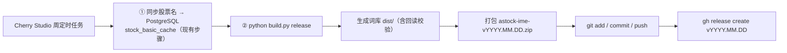

# 周更流水线：定时任务 → 自动词库 → GitHub Release

目标：**每周一个 Release**（`vYYYY.MM.DD`），普通人只从 Release 下载 zip。
整条链只要两步：已有的「同步股票名到数据库」+ 本仓库的一条 `python build.py release`。



---

## 1. 一次性准备（只做一遍）

```bash
cd astock-ime
cp config.example.json config.json      # 填表名 / 名称字段 / 库连接（详见 README 第 3 节）
pip install -r requirements.txt

gh auth status                          # 没登录就 gh auth login（需要 repo scope）
git remote -v                           # 没远端就跑：python build.py release --create-repo
python build.py all                     # 先手动确认一次取数与转换都 OK
```

Windows 侧要能非交互取到库密码，二选一：

* 系统环境变量里加 `PGPASSWORD`（或 `ASTOCK_DB_PASSWORD`）；
* 或者把 `config.json` 的 `database.access` 设成 `docker`，走 `docker exec psql`，
  容器内本地套接字免密（本仓库默认 `auto`：直连失败自动降级 docker）。

「深蓝词库转换」的路径写在 `config.json → tools.imewl_converter`。
没有它也不会失败：`.dat/.xml` 那一步会跳过并提示下载地址，其余文本词库照常生成。

---

## 2. 在 Cherry Studio 的周任务里追加一步

菜单名随版本略有差异（定时任务 / 自动化 / Scheduled Task），做法是在**已有同步任务之后**
再加一个执行命令的步骤，同一周任务里串行跑：

```bash
cd /c/Users/<你>/Desktop/temp/test/已处理/股票词库/astock-ime && \
  python build.py release --targets win10mspy,mspy 2>&1 | tee -a logs/release-$(date +%F).log
```

* 只想要更小的词库（比如只要活跃票）：`python build.py release --freq hot --limit 3000`
* 想每周五各来一次：把这条挂第二个定时点即可，同一天重复执行只会覆盖当周附件（`--clobber`）

如果你的任务面板只能填 Windows 计划任务式命令行，等价写法：

```bat
cmd /c "cd /d C:\Users\<你>\Desktop\temp\test\已处理\股票词库\astock-ime && python build.py release > logs\release.log 2>&1"
```

> `logs/` 目录已被 `.gitignore` 忽略，随便写。

---

## 3. 看日志判断成没成

正常收尾长这样：

```text
[imewl] win10mspy    -> ms_pinyin_astock.dat       OK  导入 5552 / 过滤 0 / 导出 5552
[verify] ms_pinyin_astock.dat       回读 5552/5552 OK
[pkg] astock-ime-v2026.09.04.zip  382,593 B  （8 个词库文件 + 导入说明 + meta/3）
[run] git push origin main   rc=0 ...
[gh] release v2026.09.04 已就绪，附件：astock-ime-v2026.09.04.zip
```

| 现象 | 含义 / 处理 |
|---|---|
| `[verify] ... LOSS` | 产物条数少于导出条数 → 该格式在当前深蓝版本下不可靠，改用文本词库路线，别发布这个文件 |
| `[db] 该方式失败` 后紧跟 `取到 N 条` | auto 降级到 docker 成功，正常 |
| `无法从数据库获取股票名称` | 库没起来 / 密码没给 / 表名不对，先 `python build.py export` 单独验取数 |
| `[gh] 没装 GitHub CLI` / `没有配置 git remote` | zip 已生成，去仓库 Releases 手工上传 `dist/*.zip`，tag 填 `vYYYY.MM.DD` |
| `[release] 推送未成功，暂不发布` | 网络或权限问题；此时不会建 release，避免 tag 指向旧提交 |

排障时先干跑，只看会执行哪些命令：

```bash
python build.py release --dry-run --skip-gh
```

---

## 4. 幂等 / 回滚

* **同一周重跑**：tag 已存在 → 只 `gh release upload --clobber` 覆盖 zip，不产生第二个 release；
* **当天要出第二版**：`python build.py release --version v2026.09.04.2`；
* **删掉本周 release**：`gh release delete v2026.09.04 --cleanup-tag -y`；
* **只想重新打包不发布**：`python build.py release --skip-git --skip-gh`；
* CI（`.github/workflows/build.yml`）走的是 `examples/` 里的离线样例，只用于跑测试和产出可下载的
  artifact，**不会**替你发 Release——线上词库永远来自那条定时任务，数据源是你自己的库。
